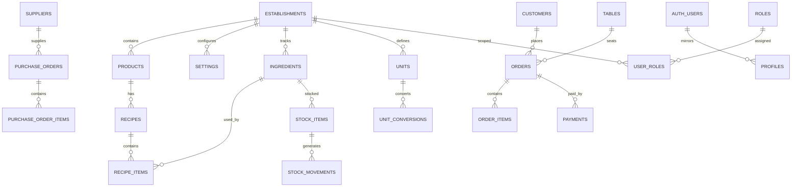

# Database — Architecture Supabase (PHASE 03)

Ce document décrit l'architecture PostgreSQL mise en place pour CafeRest.
Toutes les tables sont créées par des migrations SQL dans `supabase/migrations/`
et sont la seule source de vérité (aucune table TypeScript uniquement).

## Principes

- UUID (`gen_random_uuid()`) pour toutes les clés primaires.
- Dates/heures en `timestamptz`.
- Chaque table a `id`, `created_at`, `updated_at` (sauf règles d'immutabilité).
- RLS activé sur **toutes** les tables métier.
- Isolation par `establishment_id` : un utilisateur ne voit que son établissement.
- Le stock est **traçable par mouvements** (jamais de modification directe).

## Tables (34)

| Table                   | Rôle                                     |
| ----------------------- | ---------------------------------------- |
| `establishments`        | Établissements (multi-établissement)     |
| `establishment_members` | Appartenance utilisateur ↔ établissement |
| `settings`              | Configuration clé-valeur centralisée     |
| `locales`               | Langues (fr, en, ar + RTL)               |
| `units`                 | Unités de mesure                         |
| `unit_conversions`      | Conversions (kg→g, L→ml, cl→ml)          |
| `categories`            | Catégories hiérarchiques                 |
| `taxes`                 | Taux de TVA configurables                |
| `products`              | Produits vendus                          |
| `ingredients`           | Matières premières (stock)               |
| `recipes`               | Recettes                                 |
| `recipe_items`          | Ingrédients d'une recette                |
| `recipe_yields`         | Rendement (min/std/max)                  |
| `suppliers`             | Fournisseurs                             |
| `purchase_orders`       | Commandes d'achat                        |
| `purchase_order_items`  | Lignes de commande d'achat               |
| `inventory_locations`   | Emplacements de stock                    |
| `stock_items`           | Quantités par ingrédient/emplacement     |
| `stock_movements`       | Mouvements de stock traçables            |
| `profiles`              | Profils (liés à `auth.users`)            |
| `roles`                 | Rôles applicatifs                        |
| `user_roles`            | Rôles par utilisateur/établissement      |
| `dining_areas`          | Zones de salle                           |
| `tables`                | Tables de salle                          |
| `customers`             | Clients                                  |
| `orders`                | Commandes                                |
| `order_items`           | Lignes de commande                       |
| `payment_methods`       | Moyens de paiement                       |
| `payments`              | Paiements                                |
| `cash_registers`        | Caisses                                  |
| `cash_sessions`         | Sessions de caisse                       |
| `expenses`              | Dépenses                                 |
| `notifications`         | Notifications (Realtime)                 |
| `audit_logs`            | Journal d'audit (immutable)              |

## Relations clés



## Chaîne recette → stock

```
Produit vendu
   → Recette (recipes)
   → Ingrédients (recipe_items)
   → Unités / Conversions (units, unit_conversions)
   → Rendement (recipe_yields : min / standard / max)
   → Consommation théorique
   → Mouvement stock (stock_movements : sale_consumption)
```

Exemple café : une recette `1 kg café → 85 tasses (standard)` calcule la
consommation de chaque tasse à partir des `recipe_items`.

## RLS

Règle centrale : `belongs_to_establishment(establishment_id)` → l'utilisateur
est membre de l'établissement (via `user_roles`) **ou** est `super_admin`.
Jamais `USING (true)` sur les données métier.

Fonctions d'aide (dans `migrations/022_security_functions.sql`) :

- `is_establishment_member(est_id)`
- `has_role(est_id, role_code)`
- `is_super_admin()`
- `belongs_to_establishment(est_id)`
- `get_setting(p_key)`
- `get_establishment_settings(p_establishment_id)`

## Rôles

`super_admin`, `admin`, `manager`, `cashier`, `waiter`, `kitchen`, `bar`,
`stock_manager`, `purchasing`, `accountant`.

## Stock traçable

`stock_movements` capture chaque changement :
`purchase`, `sale_consumption`, `transfer_in`, `transfer_out`,
`adjustment_in`, `adjustment_out`, `waste`, `return`, `opening`.

Chaque mouvement référence l'ingrédient, l'emplacement, la quantité, les coûts
et (optionnel) la transaction source (`reference_type` / `reference_id`).

## Transactions futures

Les opérations critiques (vente → paiement → consommation recette → mouvement,
réception achat → stock → coût) s'appuieront sur le schéma ci-dessus pour être
exécutées dans des transactions cohérentes.

## Storage

Bucket `branding` (public) pour `logo` / `favicon`. Seuls les chemins/URL sont
stockés en base — jamais le binaire base64.
